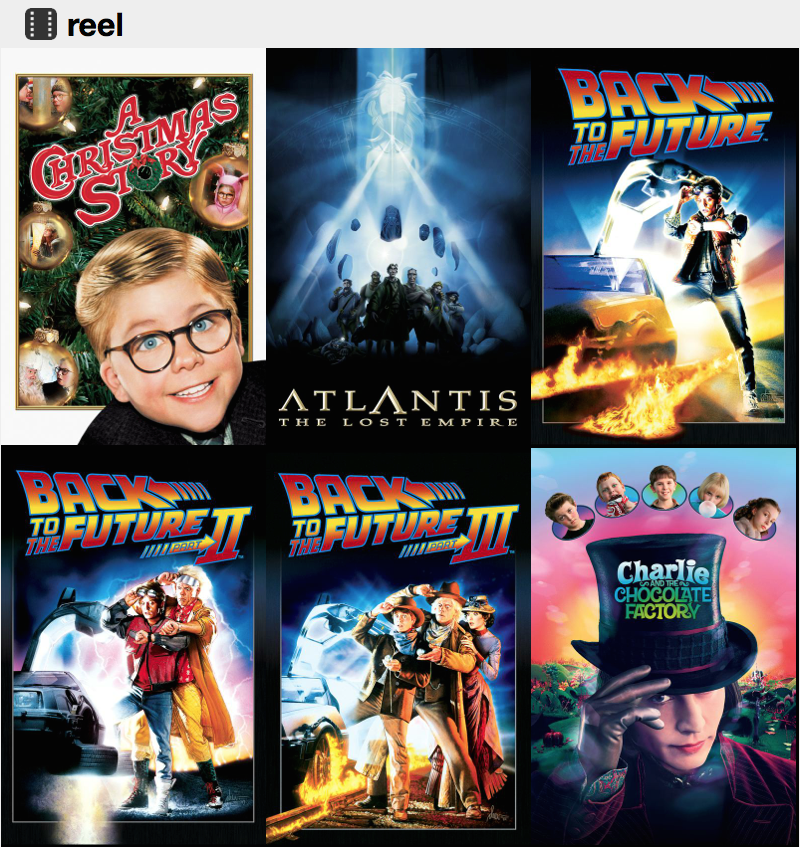

## reel

reel is a HTTP movie share, think XBMC for web browsers



## Requirements

Run `pip install twisted flask beautifulsoup4` to make sure you have all the requirements.

## Configuration

You must change movie_path in reel.py to your movie direcotry.
The movie directory should have movies organized into subfolders, with thumbnails(jpg, png or tbn) and XBMC-style .nfo files.
```
$ ls /movies/back-to-the-future-part-1-1985/
back-to-the-future-part-1-1985.m4v  back-to-the-future-part-1-1985.nfo  back-to-the-future-part-1-1985.tbn
```

You may need to modify your /etc/mime.types to support extra files.
```
image/jpeg                                      jpeg jpg jpe tbn
video/mp4                                       mp4 m4v
```

nfo files will be read for the <sorttile> tag
```
<movie>
        <sorttitle>harry potter 4</sorttitle>
</movie>
```
## Usage

`python server.py`

## License

reel is licensed under GPL 3.0, see LICENSE

Photo-Video-Film.ico and Photo-Video-Film-icon.png are from http://www.iconarchive.com/show/icons8-metro-style-icons-by-visualpharm/Photo-Video-Film-icon.html copyright http://www.visualpharm.com/
