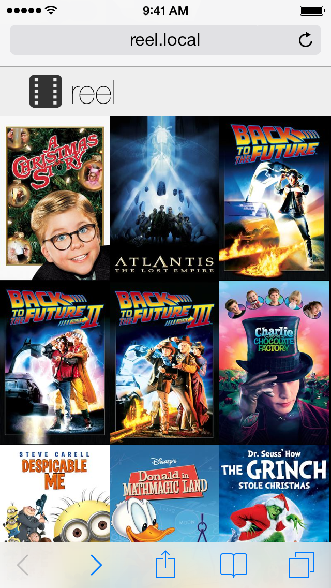

## reel

reel is a HTTP movie share, think XBMC for web browsers

## Configuration

You must change movie_path in reel.py to your movie direcotry.

## License

reel is licensed under GPL 3.0, see LICENSE

Photo-Video-Film.ico and Photo-Video-Film-icon.png are from http://www.iconarchive.com/show/icons8-metro-style-icons-by-visualpharm/Photo-Video-Film-icon.html copyright http://www.visualpharm.com/
